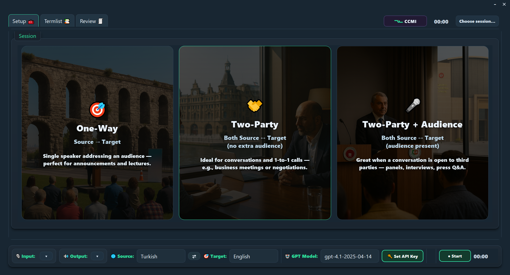
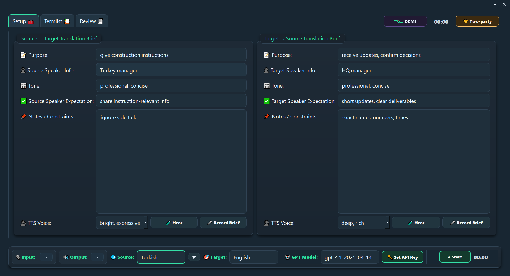
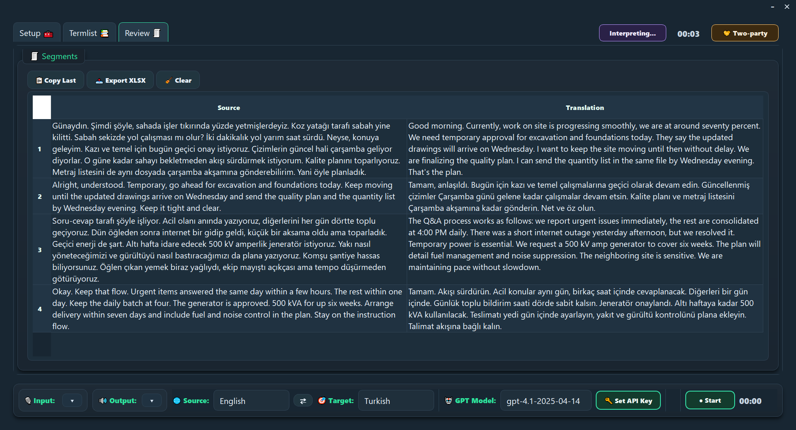

<p align="center">
  <a href="../../releases/latest">
    
  </a>
  <a href="../../releases/latest">
    
  </a>
  <a href="./LICENSE">
    
  </a>
  <a href="https://github.com/pasabayramoglu/ccmi/releases">
    
  </a>
</p>

# CCMI — Customized Consecutive Machine Interpreter

> **🎛️ We Customized Translation, Why Not Interpreting?**

**CCMI** is a desktop PyQt5 app that turns your microphone into a *customizable consecutive interpreter*:
**mic → Whisper ASR → GPT (brief + termlist + context) → TTS**.
It adapts to the session (one‑way, two‑party, or two‑party + audience), keeps terminology consistent, and speaks back in the voice you choose.

---

## Download
- **Windows (ready-to-use):** [Download CCMI_Windows_x64.zip](../../releases/latest/download/CCMI_Windows_x64.zip)
- Or visit the **[latest release](../../releases/latest)** for all assets.


> After download: unzip and run **`ccmi.exe`**. Click **🔑 Set API Key** and paste an OpenAI key (`sk-…`).

---

## Why interpreting needs customization

* **🧵 Customization doesn’t cross the mic.**
  Traditional tools treat interpreting as one-size-fits-all: no pre‑briefs, no termlists, no tone or audience intent.
* **⏱️ Too many steps, too much lag.**
  Speech → text → translation → voice. Each hop adds delay and loses detail.
* **🧩 Sessions are not identical.**
  A sales call, a lecture, and a panel get treated the same. No session modes or memory per party.

## ⭐ Why CCMI?

* **🧭 Fits your setup.** Solo talk? Two-person call? Conversation with listeners? Pick the right mode so roles and direction are clear.
* **🎙️ Tell it once, CCMI prepares.** Describe your session and CCMI fills a minimal brief: purpose, roles, tone, and rules.
* **📚 Your terms, locked in.** Import a list or add your own. Names and phrases stay consistent across the whole session.
* **🎧 Voices for every tone.** Choose among built-in voice styles and test them anytime.
* **🧠 Context that grows.** Each new segment adapts to your brief, prior translations, and termlist.

---

## Screenshots

**Session selection**


**Two-party customization**


**Translation & review**


---

## Features

* **Session modes**: One‑Way, Two‑Party, Two‑Party + Audience
* **Briefs** for each direction, plus **Audience** fields when relevant
* **Termlist**: CSV/XLSX import, in‑app edit, clear/add/delete
* **Review table**: “Copy Last” + **XLSX export**
* **Device picker & meters**, language **Swap** (Ctrl/⌘+Enter), **Shift+Space** to record
* **Voice tester** and multiple TTS styles
* **Privacy**: API key lives in memory only; temp audio files are removed
* **Online**: uses OpenAI APIs for ASR, translation, and TTS

---

## OpenAI Models & Voices

CCMI uses OpenAI for the full pipeline:

* **ASR (speech → text):** `whisper-1`
* **Translation / brief filling:** default `gpt-4.1-2025-04-14` (editable in the UI)
* **TTS (text → speech):** `gpt-4o-mini-tts`

> Your API key is stored **in memory only** for the running session. Temporary audio files are cleaned up after use.

### Built-in voice styles

| Feel               | Voice ID  |
| ------------------ | --------- |
| neutral, balanced  | `alloy`   |
| warm, natural      | `ash`     |
| deep, rich         | `ballad`  |
| bright, expressive | `coral`   |
| clear, energetic   | `echo`    |
| calm, steady       | `sage`    |
| light, youthful    | `shimmer` |
| bold, dramatic     | `verse`   |

In two-party modes, CCMI automatically picks the section’s voice based on direction. Use **🧪 Hear** to audition.

---

## Quick start from source (Windows/macOS/Linux)

Requirements: **Python 3.9+**, microphone & speakers.

```bash
python -m venv .venv

# Windows
.venv\Scripts\activate
# macOS / Linux
source .venv/bin/activate

pip install -r requirements.txt
python ccmi.py
```

### Keyboard shortcuts

| Action               | Keys                                                 |
| -------------------- | ---------------------------------------------------- |
| Start/Stop recording | **Shift + Space**                                    |
| Swap Source ↔ Target | **Ctrl + Enter** (Win/Linux) / **⌘ + Enter** (macOS) |
| Test section voice   | **🧪 Hear** button                                   |

---

## Session modes

* **🎯 One‑Way (A → B)** — announcements/lectures; includes Audience fields.
* **🤝 Two‑Party (A ↔ B)** — conversations/calls; separate briefs for each direction.
* **🎤 Two‑Party + Audience (A ↔ B + 👥)** — conversations with listeners; adds Audience fields.

---

## Terminology (CSV/XLSX)

* Two columns: **Source Term**, **Target Term** (headers optional).
* Import via **Termlist → “Import Termlist (XLSX/CSV)”**.
* During translation, exact pairs are enforced (`source = target`).
  *(XLSX import/export requires `openpyxl` — optional dependency.)*

---

## Export & review

* **Review → Export XLSX** saves the segment table with wrapped cells.
* **Copy Last** puts the newest translation on your clipboard.

---

## Build the Windows executable yourself

This repo ships with **`ccmi.spec`** for PyInstaller.

```bash
pip install -r requirements.txt
pip install pyinstaller
pyinstaller ccmi.spec
```

* Your app will be in `dist/ccmi/`. Zip that folder and attach it as a **Release asset** (don’t commit `dist/` or `build/`).
* To shrink size, install **UPX** and pass `--upx-dir` to PyInstaller, or remove optional deps you don’t need (e.g., `openpyxl`).

---

## Tech notes

* GUI: **PyQt5**
* Audio I/O: **sounddevice**, **soundfile** (16 kHz mono capture)
* ASR: **OpenAI `whisper-1`**
* Translation: **Chat Completions** (model configurable; default `gpt-4.1-2025-04-14`)
* TTS: **`gpt-4o-mini-tts`** with selectable voices (`alloy`, `ash`, `ballad`, `coral`, `echo`, `sage`, `shimmer`, `verse`)

---

## Privacy & security

* API key is requested at runtime and **not written to disk**.
* Temporary audio files are **deleted** after use.
* No telemetry, analytics, or background upload.
* You are responsible for complying with OpenAI API Terms in your region.

---

## Troubleshooting

* **“No OpenAI API key set.”** → Click **Set API Key**.
* **“No usable audio devices were found.”** → Plug in a mic/speaker and reopen CCMI.
* **Import XLSX fails** → Install `openpyxl` or use CSV instead.
* **No sound on playback** → Pick the correct 🔊 output device and try **🧪 Hear**.
* **Large prompts** → CCMI caps rolling context to \~5,000 chars to keep latency reasonable.

---

## Contributing

PRs and issues are welcome! If you’re proposing larger changes, please open an issue first to discuss scope/fit.

---

## License

**MIT** — see [`LICENSE`](./LICENSE).
